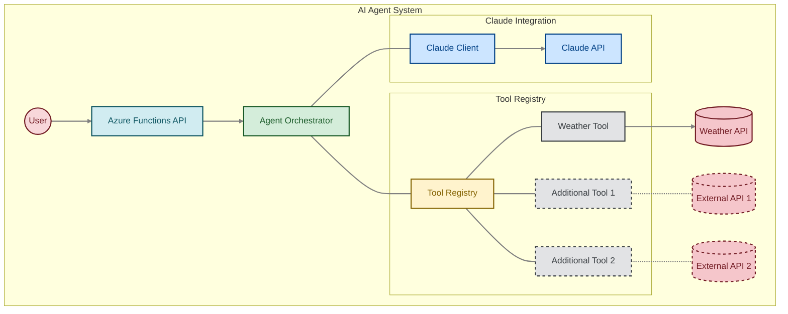
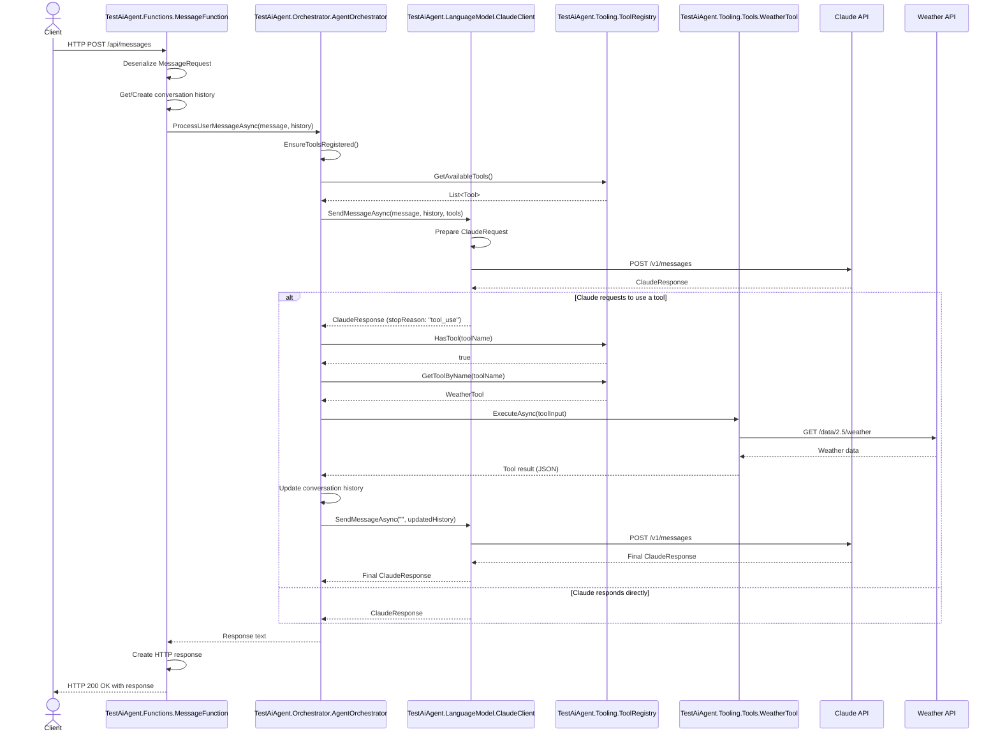

# Claude AI Agent - Azure Function

An Azure Function implementation of an AI agent using Anthropic's Claude API and custom tools. This project demonstrates how to create a serverless AI agent that can maintain conversation state and integrate with external services.

Seb Harvey 
March 2025

## Features

- Integrates with Claude API for natural language processing
- Extensible tool framework for adding new capabilities
- Session-based conversation management
- Example weather tool implementation
- Secure configuration via Azure Key Vault
- Serverless deployment via Azure Functions

## Architecture

The agent is built on a .NET isolated Azure Function architecture with these core components:

- **MessageFunction**: HTTP-triggered function that processes user messages
- **ClaudeClient**: Client for communicating with the Claude API
- **ToolRegistry**: Registry for managing available tools
- **AgentOrchestrator**: Coordinates the conversation flow between Claude and tools





## Prerequisites

- [Azure Functions Core Tools](https://docs.microsoft.com/en-us/azure/azure-functions/functions-run-local)
- [.NET 7 SDK](https://dotnet.microsoft.com/download/dotnet/7.0)
- [Azure CLI](https://docs.microsoft.com/en-us/cli/azure/install-azure-cli) (for deployment)
- Anthropic Claude API key
- OpenWeather API key (for the weather tool)


## Using the API

The API exposes these endpoints:

- `POST /api/messages` - Send a message to the agent
- `GET /api/sessions/{sessionId}` - Get session history
- `DELETE /api/sessions/{sessionId}` - Clear a session

### Example Requests & Responses

#### Sending a Message

**Request:**
```http
POST /api/messages
Content-Type: application/json
x-functions-key: your-function-key

{
  "message": "What's the weather like in Seattle?",
  "sessionId": "user123"
}
```

**Response:**
```json
{
  "response": "I'll check the current weather in Seattle for you. According to the weather service, it's currently 52°F (11°C) with light rain. The humidity is at 84% with wind speeds of 8 mph from the southwest. The forecast shows rain continuing throughout the day with temperatures remaining steady. Would you like to know about the weather for the upcoming days as well?"
}
```

#### Follow-up Question

**Request:**
```http
POST /api/messages
Content-Type: application/json
x-functions-key: your-function-key

{
  "message": "Yes, what about tomorrow?",
  "sessionId": "user123"
}
```

**Response:**
```json
{
  "response": "Looking at tomorrow's forecast for Seattle, it shows partly cloudy conditions with temperatures reaching a high of 58°F (14°C) and a low of 48°F (9°C). There's a 30% chance of light showers in the morning, but it should clear up by the afternoon. Wind speeds will be around 5-10 mph. Overall, it looks like a slight improvement over today's weather."
}
```

#### Get Session History

**Request:**
```http
GET /api/sessions/user123
x-functions-key: your-function-key
```

**Response:**
```json
{
  "history": [
    {
      "role": "user",
      "content": "What's the weather like in Seattle?"
    },
    {
      "role": "assistant",
      "content": "I'll check the current weather in Seattle for you. According to the weather service, it's currently 52°F (11°C) with light rain. The humidity is at 84% with wind speeds of 8 mph from the southwest. The forecast shows rain continuing throughout the day with temperatures remaining steady. Would you like to know about the weather for the upcoming days as well?"
    },
    {
      "role": "user",
      "content": "Yes, what about tomorrow?"
    },
    {
      "role": "assistant",
      "content": "Looking at tomorrow's forecast for Seattle, it shows partly cloudy conditions with temperatures reaching a high of 58°F (14°C) and a low of 48°F (9°C). There's a 30% chance of light showers in the morning, but it should clear up by the afternoon. Wind speeds will be around 5-10 mph. Overall, it looks like a slight improvement over today's weather."
    }
  ]
}
```

#### Clear a Session

**Request:**
```http
DELETE /api/sessions/user123
x-functions-key: your-function-key
```

**Response:**
```json
{
  "message": "Session cleared successfully"
}
```

## Adding Custom Tools

To add a new tool to the agent:

1. Create a new tool class that implements the `ITool` interface
2. Register the tool in `Program.cs`
3. Update the configuration in `appsettings.json` as needed

Example of a simple translation tool interface:

```csharp
public interface ITranslationTool : ITool { }

public class TranslationTool : ITranslationTool
{
    // Implementation details...
    
    public Tool Definition => new Tool
    {
        Name = "translate_text",
        Description = "Translate text from one language to another",
        Input = new ToolInput
        {
            Type = "object",
            Properties = new Dictionary<string, ToolProperty>
            {
                {
                    "text", new ToolProperty
                    {
                        Type = "string",
                        Description = "The text to translate"
                    }
                },
                {
                    "source_language", new ToolProperty
                    {
                        Type = "string",
                        Description = "The source language code"
                    }
                },
                {
                    "target_language", new ToolProperty
                    {
                        Type = "string",
                        Description = "The target language code"
                    }
                }
            },
            Required = new List<string> { "text", "target_language" }
        }
    };

    public async Task<string> ExecuteAsync(JsonElement input)
    {
        // Translation logic here
    }
}
```
 